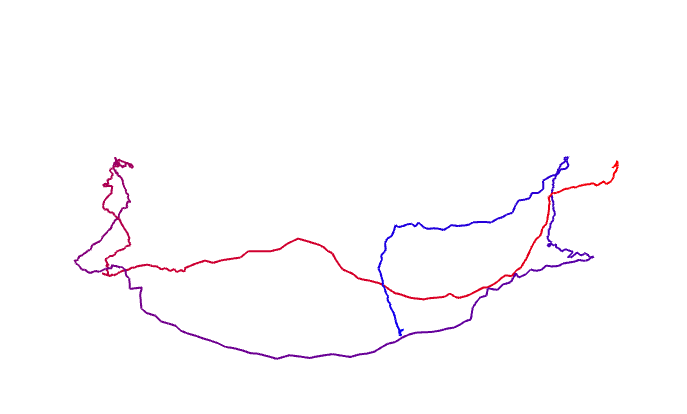

## Dependencies

- Eigen
- Sophus 
- pangolin
	-  download it from github: https://github.com/stevenlovegrove/Pangolin
	- install dependency for pangolin (mainly the OpenGL): 
		 `sudo apt-get install libglew-dev`
	* compile and install pangolin
	  ```cd [path-to-pangolin]
	  mkdir build
	  cd build
	  cmake ..
	  make 
	  sudo make install
	  ```
	
	   

## Compile

```
mkdir build
cd build
cmake ..
make
```

## How to run

### 1. draw_trajectory

```
./build/draw_trajectory
```




